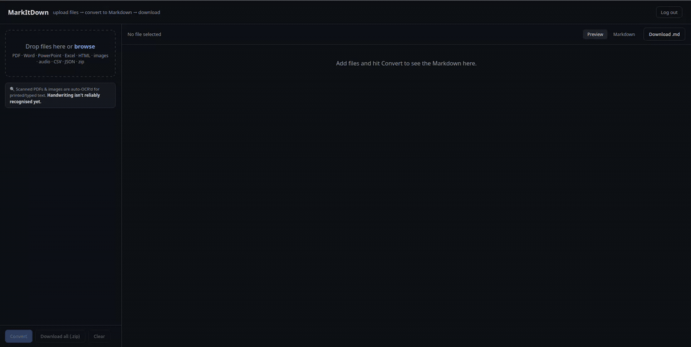

# MarkItDown Web

Turn any file — PDF, Word, PowerPoint, Excel, HTML, images, audio, CSV, JSON,
zip — into clean Markdown, from a browser or over an API. Scanned pages and
images get OCR'd automatically.



The point is tokens. Feeding a raw `.pdf` or `.docx` straight into an LLM is
wasteful — the file is full of binary structure, styling, and layout noise the
model has to pay for. Markdown is famously lean: the same content, stripped to
text and structure, costs a fraction of the tokens. So before an agent (or you)
reasons over a file, run it through here and hand the model the `.md` instead.

This isn't a new conversion engine. It's a wrapper — I took a couple of solid
open-source projects, stitched them into one small UI, and made the whole thing
task-specific: point a human *or* an agent at it and get Markdown back. Nothing
new; just taping good stuff together.

Files are converted **in memory** and never written to disk. Nothing is stored.

---

## Just want to use it?

Pick one of these. All three end with the app on `http://127.0.0.1:5005`.

### Option A — Docker (nothing to install but Docker)

OCR tools come baked into the image.

```bash
git clone https://github.com/Daisentaur/local-markdown.git
cd local-markdown
cp .env.example .env          # then edit .env (username, password, API key)
docker compose up -d
```

### Option B — one-command native install (Linux)

Builds a virtualenv, installs the OCR tools, generates `.env` with fresh
secrets, and optionally installs a systemd service for 24/7 running.

```bash
git clone https://github.com/Daisentaur/local-markdown.git
cd local-markdown
./setup.sh
```

### Option C — just run it locally, no login

For quick throwaway local use (no auth at all):

```bash
./run.sh
```

First launch builds the venv and installs deps (needs internet once).

> **Want OCR on native installs?** `sudo apt install ocrmypdf tesseract-ocr`.
> Docker already includes them. Without them, everything else still works —
> OCR just no-ops.

### Then — use it

**In a browser:** open `http://127.0.0.1:5005`, log in (if you set a
username/password), drag files in, hit **Convert**, preview, and download the
`.md` — one file or all of them as a zip.

**From an agent or script:** the browser uses a session cookie a script can't
carry, so set an `API_KEY` in `.env` and send it as a header. No login needed:

```bash
curl -H "X-API-Key: $API_KEY" \
     -F "files=@report.pdf" \
     http://127.0.0.1:5005/api/convert
```

You get back:

```json
{"results": [
  {"name": "report.md", "source": "report.pdf",
   "markdown": "# Q3 Report\n\n| Region | Revenue |\n...",
   "ocr": false, "error": null}
]}
```

The Markdown is in `results[].markdown`. `ocr` is `true` when the text was
recovered from a scan/image. Point any of your projects' agents at this one
endpoint and they all get token-optimized Markdown before doing their real work
— including when they're handing files to *each other*.

To reach it from other machines (and get HTTPS on your own subdomain) put a
Cloudflare Tunnel in front — see **[DEPLOY.md](DEPLOY.md)**.

---

## How it works

The whole thing is a thin Flask app around three existing tools:

- **[markitdown](https://github.com/microsoft/markitdown)** (Microsoft) does the
  actual file → Markdown conversion for ~all the formats. It reads *embedded*
  text, so a normal PDF/docx/xlsx converts directly.
- **[OCRmyPDF](https://github.com/ocrmypdf/OCRmyPDF)** handles scanned /
  image-only PDFs — markitdown can't read those (there's no embedded text), so
  OCRmyPDF adds a real text layer first, then markitdown reads it as usual.
- **[Tesseract](https://github.com/tesseract-ocr/tesseract)** does OCR on
  standalone image files (`.png`, `.jpg`, `.tiff`, …).

A request flows like this:

1. A file comes in via `POST /api/convert` (browser fetch or an agent's header).
2. `convert_one()` looks at the extension:
   - **image** → straight to Tesseract, return the recognized text.
   - **anything else** → markitdown converts it. If it's a PDF that came back
     with essentially no text (a scan), OCRmyPDF adds a text layer and
     markitdown re-reads it.
   - **normal text files** skip OCR entirely — no slowdown.
3. Each result is returned as `{name, source, markdown, ocr, error}`. One bad
   file comes back with an `error` string instead of failing the whole batch.

The OCR glue lives in [`ocr.py`](ocr.py) and shells out to the two CLIs, so it
doesn't even touch the Python virtualenv — if the binaries aren't installed, it
quietly no-ops.

**Auth** has two doors. Browsers use a normal session login
(`ADMIN_USERNAME` / `ADMIN_PASSWORD`, cookie signed by `SECRET_KEY`). Agents use
an `API_KEY` sent as `X-API-Key:` (or `Authorization: Bearer`). Set the login
vars and login turns on; leave them unset and the app runs open (fine for
localhost).

### Project layout

```
local-markdown/
├── app.py              # Flask backend: upload, convert, zip, auth
├── ocr.py              # OCR layer (ocrmypdf + tesseract), CLI-based
├── index.html          # UI: drag/drop, live preview, downloads
├── login.html          # Sign-in page (only when login is enabled)
├── static/marked.min.js# Markdown preview renderer (bundled, offline)
├── Dockerfile          # container image with OCR baked in
├── docker-compose.yml  # one-command Docker run
├── setup.sh            # one-command native installer
├── run.sh              # local launcher, no login
├── run-public.sh       # reads .env, enables the admin login
├── deploy/markitdown.service  # systemd unit for 24/7 hosting
├── DEPLOY.md           # homelab + Cloudflare Tunnel walkthrough
└── .env.example        # copy to .env for secrets
```

---

## OCR (scanned PDFs & images)

markitdown only reads *embedded* text, so a scanned PDF or a photo of a document
comes back empty. The OCR layer fixes that — and only kicks in when it's needed,
so regular files pay no penalty. Converted results carry `"ocr": true` when text
was recovered this way, and the UI shows a small banner.

Install the tools once (they're system packages, not pip):

```bash
sudo apt install ocrmypdf tesseract-ocr          # Debian/Ubuntu/Mint
# extra languages, e.g. French:  sudo apt install tesseract-ocr-fra
```

> ⚠️ **Handwriting is not reliably supported.** Tesseract targets printed/typed
> text. Reading handwriting well needs a vision model (a GPU or a paid API),
> which is deliberately out of scope for this CPU-friendly layer. Printed and
> scanned documents are the supported case; handwriting is on the roadmap.

---

## Configuration

All via environment variables (or `.env`):

| Variable | Meaning | Default |
|---|---|---|
| `HOST` | Bind address | `127.0.0.1` |
| `PORT` | Port | `5005` |
| `ADMIN_USERNAME` / `ADMIN_PASSWORD` | Set both to enable the browser login | unset (login off) |
| `API_KEY` | Lets agents/scripts call `/api/` via `X-API-Key` | unset (API path off) |
| `SECRET_KEY` | Signs login cookies — set a fixed random value in production | random per start |
| `OCR_ENABLED` | Master switch for OCR (`0` disables) | `1` |
| `OCR_LANGUAGE` | Tesseract language(s), e.g. `eng`, `eng+fra` | `eng` |
| `OCR_PDF_TEXT_THRESHOLD` | Below this many chars, a PDF is treated as scanned | `16` |
| `OCR_TIMEOUT` | Per-file OCR time cap (seconds) | `240` |

Generate strong secrets:

```bash
python3 -c "import secrets; print(secrets.token_hex(32))"                 # SECRET_KEY
python3 -c "import secrets; print('mid_'+secrets.token_urlsafe(32))"      # API_KEY
```

Upload size is capped at 100 MB/request (`MAX_CONTENT_LENGTH` in `app.py`).

**Endpoints**

- `POST /api/convert` — one or more files → `{results: [{name, source, markdown, ocr, error}]}`.
- `POST /api/zip` — bundles `{name, markdown}` entries into `markdown.zip` (duplicate names de-collided).
- `GET /login`, `POST /login`, `GET /logout` — only active when login is enabled.

---

## Running it 24/7 on your own domain

The app listens on localhost only. To reach it from anywhere with HTTPS and no
port-forwarding, a **Cloudflare Tunnel** connects your subdomain to the local
app. Full walkthrough — gunicorn + systemd + the tunnel — is in
**[DEPLOY.md](DEPLOY.md)**. `setup.sh` can install the systemd service for you.

---

## Limitations & caveats

- **Handwriting** isn't reliably recognized (see OCR note above).
- **Audio transcription** uses markitdown's online recognizer, so that specific
  step needs internet; audio metadata/format handling works offline. A static
  `ffmpeg` ships via `imageio-ffmpeg`, so `.mp3`/`.wav` work with no separate
  install.
- OCR trades speed for text — a big scanned PDF takes a few seconds per page on
  CPU. Normal text files are unaffected.
- It converts; it doesn't summarize. Getting *fewer, cleaner* tokens is the job;
  what the LLM does with them is yours.

## Roadmap

- Looking into more connectivity possibilities maybe.
- Broader language packs surfaced in the UI.

## Security notes

- Secrets live in `.env`, which is gitignored and should be `chmod 600`.
- The app binds to localhost; only the Cloudflare Tunnel (or your own proxy)
  should expose it. For a second gate, Cloudflare Access can restrict the site
  to your email — see the note in [DEPLOY.md](DEPLOY.md).
- API keys and passwords are compared in constant time.

---

Built on [microsoft/markitdown](https://github.com/microsoft/markitdown) ·
OCR by [OCRmyPDF](https://github.com/ocrmypdf/OCRmyPDF) and
[Tesseract](https://github.com/tesseract-ocr/tesseract) · preview via
[marked](https://github.com/markedjs/marked) · bundled ffmpeg via
[imageio-ffmpeg](https://github.com/imageio/imageio-ffmpeg).

MIT licensed — see [LICENSE](LICENSE).
